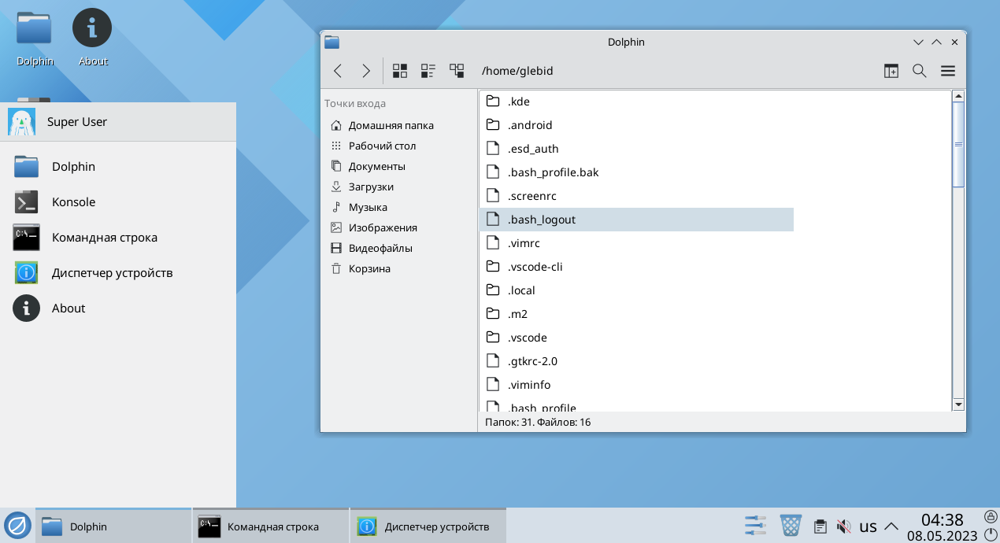

# Fake OS Desktop

This is a cross-platform Java Swing application which are imitating Plasma KDE desktop environment from ROSA Fresh Linux distribution.

This project was a part of my universities course work, so it is initially written with Russian localization. Cause this project is purely study work, and I am not proficient with Java, it may have many architecture flaws.

Despite on project origin, I hope this can be helpful for someone who strive to know which kind of application can be created with pure Java and its basic Swing library for cross-platform GUI.

## Build and run

To compile java code and prepare all of resources execute this:

```bash
mvn clean validate compile install -f pom.xml
```

Now you can set up run configuration in your IDE for running program in a simple way with classpath dependencies and Main class. Alternatively you can run prepared .jar archive from target directory with following command:

```bash
java -jar ./target/fake-os-desktop-1.1.0.jar
```

## Screenshots
[There](./docs/screenshots.md) you can find more screenshots.



## Features

Application itself has a working icons grid with a wallpaper behind it, fully functional window and task bar system, start menu panel and some of additional widgets in the corner.

Along with the Plasma KDE desktop this program has some applications which were stylized with the same KDE look:

- **Dolphin** — basic file manager. I must say, it is rather file browser, because it can't perform any operations, but moving around directories structure.
- **Microsoft's cmd console shell** — basically it is UNIX shell with Windows like formatting and command style. It was implemented only due to a study task.
- **KDE Konsole console shell** — same as cmd, but in a KDE and UNIX style.
- **Device Manager** — in the end it turned out to be a device browser which outputting some information about current systems' hardware.
- **About** — some info about the program and acknowledgement for my team (I contributed 95% of work btw). Also created due to a study task.

## Further development

I do not plan to contribute to this project anymore, but I think it may be a good thing for a newbie guy in Swing to look inside this project and understand basic principles of Swing GUI creation or some specific feature implementation.

Obviously you can find much better examples with a good initial classes design, so all of possible pull requests or issues exploring is up to you. I will definitely check out any of them.

## Third parties acknowledgement

- [Apache Batik](https://xmlgraphics.apache.org/batik/) for SVG image manipulations;
- [jHardware](https://github.com/profesorfalken/jHardware) for hardware info fetching;
- Maven for building;
- [KDE Plasma](https://kde.org/) and [ROSA Fresh](https://www.rosalinux.ru/rosa-fresh/) icons.
